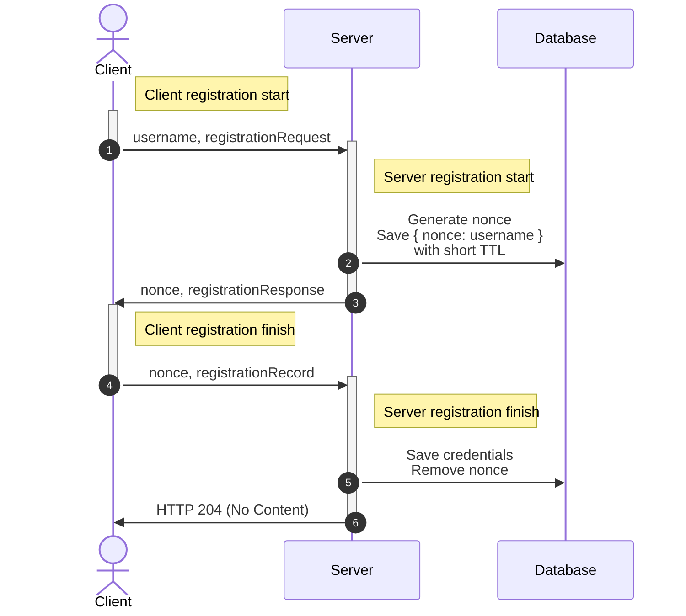
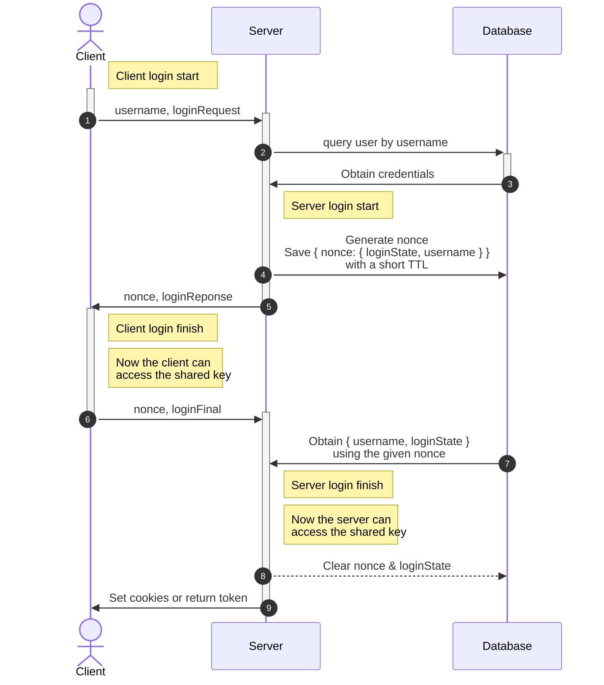

# `@47ng/opaque-client`

The OPAQUE key exchange protocol in WASM (WebAssembly), for web browsers.
This implementation is based on [facebook/opaque-ke](https://github.com/facebook/opaque-ke).

Built as ESM for browsers from [47ng/opaque-wasm](https://github.com/47ng/opaque-wasm/tree/fork/47ng-opaque/do-not-merge-to-upstream)
_(a fork of [marucjmar/opaque-wasm](https://github.com/marucjmar/opaque-wasm)
to allow server/server WASM code splitting, statelessness for the server, and uses Ristretto rather than the NIST P-256 curve)_.

Server (Node.js) counterpart is available in [`@47ng/opaque-server`](https://npmjs.com/package/@47ng/opaque-server).

## Installation

```
npm install @47ng/opaque-client
yarn add @47ng/opaque-client
pnpm add @47ng/opaque-client
```

## Usage

Reference: [OPAQUE Protocol overview](https://www.ietf.org/archive/id/draft-irtf-cfrg-opaque-09.html#name-protocol-overview).

### Registration (signup)

OPAQUE requires two handshakes to perform a signup (technically one and a half,
the final response has no cryptographic use to the client):



<br/>

```ts
import { Registration } from '@47ng/opaque-server'

const username = 'alice@example.com'
const password = 'correct horse battery staple'

async function registerClient(username: string, password: string) {
  const registration = new Registration()
  const registrationRequest = registration.start(password)
  const {
    data: { nonce, registrationResponse },
  } = await sendToServer(username, registrationRequest)
  const registrationRecord = registration.finish(password, registrationResponse)
  const { status } = await sendToServer(nonce, registrationRecord)
  registration.free()
}
```

> _Note: registration doesn't perform key exchange/agreement,
> so a login step is necessary after signup to establish a shared key._

### Login

OPAQUE requires two handshakes to perform a login.

The client will already have the key before sending the second handshake, but
the server will only be able to obtain it after doing its calculations, so
the key must not be used in the second request.



<br/>

```ts
import { Login } from '@47ng/opaque-client'

const username = 'alice@example.com'
const password = 'correct horse battery staple'

async function clientLogin(username: string, password: string) {
  const login = new Login()
  const loginRequest = login.start(password)
  const {
    data: { nonce, loginReponse },
  } = await sendToServer(username, loginRequest)
  const loginFinal = login.finish(password, loginReponse)
  const { status } = await sendToServer(nonce, loginFinal)
  const sessionKey = login.getSessionKey()
  login.free()
  return sessionKey
}
```

### Export key

After both registration and login, the client can obtain an `exportKey`,
tied to the credentials used and only available to the client.

It can be used to implement simple end-to-end self-encryption to store secret
personal data on the server.
