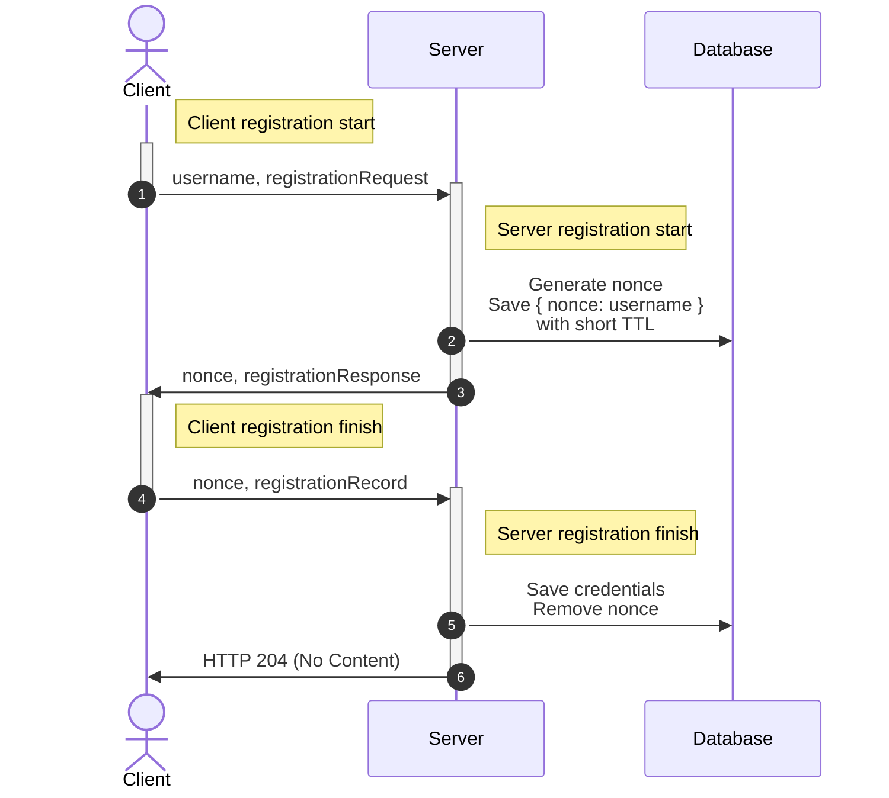
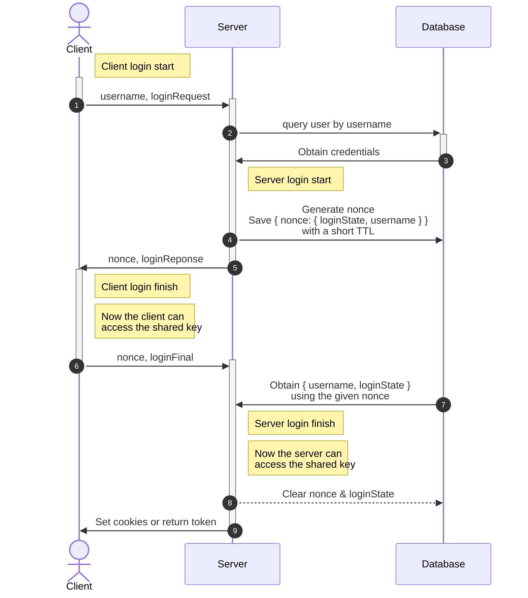

# OPAQUE Protocol Overview

Reference: [draft-irtf-cfrg-opaque-09](https://www.ietf.org/archive/id/draft-irtf-cfrg-opaque-09.html#name-protocol-overview).

## Registration (signup)

> _Note: registration doesn't perform key exchange/agreement,
> so a login step is necessary after signup to establish a shared key._

## Login

