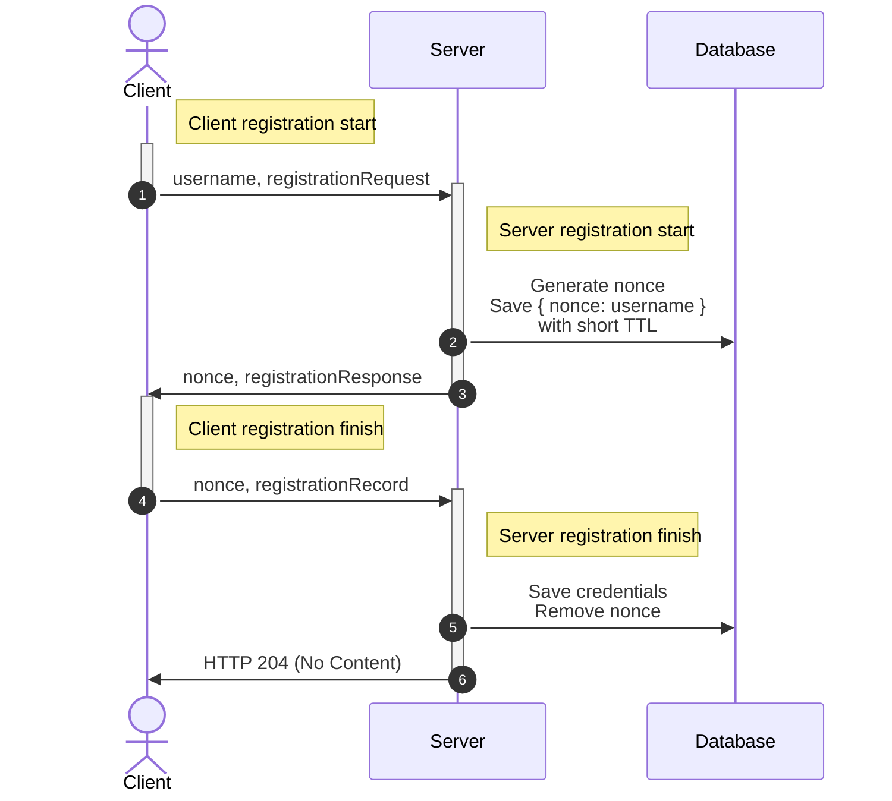
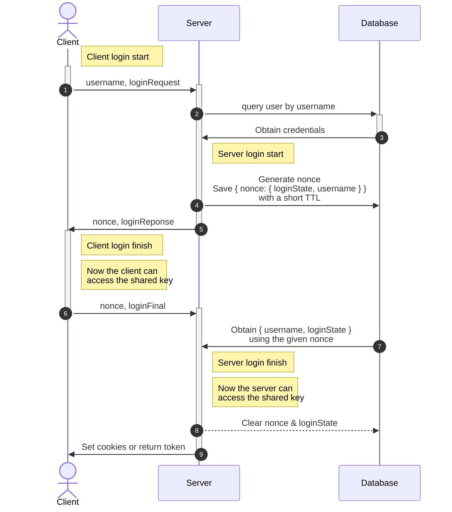

# `@47ng/opaque-server`

The OPAQUE key exchange protocol in WASM (WebAssembly), for Node.js.
This implementation is based on [facebook/opaque-ke](https://github.com/facebook/opaque-ke).

Built as CJS for Node.js from [47ng/opaque-wasm](https://github.com/47ng/opaque-wasm/tree/fork/47ng-opaque/do-not-merge-to-upstream)
_(a fork of [marucjmar/opaque-wasm](https://github.com/marucjmar/opaque-wasm)
to allow server/server WASM code splitting, statelessness for the server, and uses Ristretto rather than the NIST P-256 curve)_.

Client (browser) counterpart is available in [`@47ng/opaque-client`](https://npmjs.com/package/@47ng/opaque-client).

## Installation

```
npm install @47ng/opaque-server
yarn add @47ng/opaque-server
pnpm add @47ng/opaque-server
```

## Usage

Reference: [OPAQUE Protocol overview](https://www.ietf.org/archive/id/draft-irtf-cfrg-opaque-09.html#name-protocol-overview).

### Setup

You'll need to create a `ServerSetup` first, which is to be treated as a secret.

Changing it will invalidate your existing saved credentials, as it allows
clients to also authenticate your server (mutual authentication).
You can treat it kind of like a signature private key.

```ts
import { ServerSetup } from '@47ng/opaque-server'
import { hex } from '@47ng/codec'

const serverSetup = ServerSetup.serialize(new ServerSetup())

// serverSetup is a byte array, you can convert it to whatever
// string format suits your application (eg: hexadecimal here):
console.info(`Generated OPAQUE server setup: ${hex.encode(serverSetup)}`)
```

When starting your server, assuming you obtain this serialized `ServerSetup`
from a secure location (a secret management service like Hashicorp Vault,
a mounted file or an environment variable), you can hydrate it like so:

```ts
import { ServerSetup } from '@47ng/opaque-server'
import { hex } from '@47ng/codec'

const serverSetup = ServerSetup.deserialize(
  hex.decode(OPAQUE_SERIALIZED_SERVER_SETUP)
)
```

You will then pass this server setup to the Registration and Login handlers.

### Registration (signup)

OPAQUE requires two handshakes to perform a signup (technically one and a half,
the final response has no cryptographic use to the client):



<br/>

Pseudo-code:

```ts
import { HandleRegistration } from '@47ng/opaque-server'
import crypto from 'node:crypto'

// Request handler 1 (example path: `/registration/request`)
async function opaqueRegistrationRequest(request, response) {
  const registration = new HandleRegistration(serverSetup)
  const registrationResponse = registration.start(
    request.body.username,
    request.body.registrationRequest
  )
  const nonce = crypto.randomBytes(32).toString('hex')
  await keyValueStore.set({
    key: nonce,
    value: request.body.username,
    ttl: 120, // Something short, here 2 minutes
  })
  response.send(registrationResponse)
  registration.free()
}

// Request handler 2 (example path: `/registration/record`)
async function opaqueRegistrationRecord(request, response) {
  const registration = new HandleRegistration(serverSetup)
  // Do not trust client-provided usernames in the request body here:
  // https://github.com/facebook/opaque-ke/issues/276#issuecomment-1162609521
  const username = await keyValueStore.get({
    key: request.body.nonce,
  })
  const passwordFile = registration.finish(request.body.registrationRecord)
  await db.insert({
    username,
    passwordFile,
  })
  await keyValueStore.del({ key: request.body.nonce })
  response.status(204).send()
  registration.free()
}
```

> _Note: registration doesn't perform key exchange/agreement,
> so a login step is necessary after signup to establish a shared key._

### Login

OPAQUE requires two handshakes to perform a login.

At the end of the second handshake, the server will be able to use the key
agreed upon, and the client will already have the same key, so you can start
using that key from the second response.



<br/>

Pseudo-code:

```ts
import { HandleLogin } from '@47ng/opaque-server'

// Request handler 1 (example path: `/login/request`)
async function opaqueLoginRequest(request, response) {
  const login = new HandleLogin(serverSetup)
  const { passwordFile } = await db.findOne({
    where: { username: request.body.username },
  })
  const loginResponse = login.start(
    passwordFile,
    request.body.username,
    request.body.loginRequest
  )
  const loginState = login.serialize()
  const nonce = crypto.randomBytes(32).toString('hex')
  await keyValueStore.set({
    key: nonce,
    value: {
      username: request.body.username,
      loginState,
    },
    ttl: 120, // Something short, here 2 minutes
  })
  response.send({
    nonce,
    loginResponse,
  })
  login.free()
}

// Request handler 2 (example path: `/login/final`)
async function opaqueLoginFinal(request, response) {
  const { username, loginState } = await keyValueStore.get({
    key: request.body.nonce,
  })
  const login = HandleLogin.deserialize(loginState)
  const sessionKey = login.finish(request.body.loginFinal)
  await keyValueStore.del({ key: request.body.nonce })
  response.setAuthCookiesFor(username)
  response.send(...)
  login.free()
}
```
